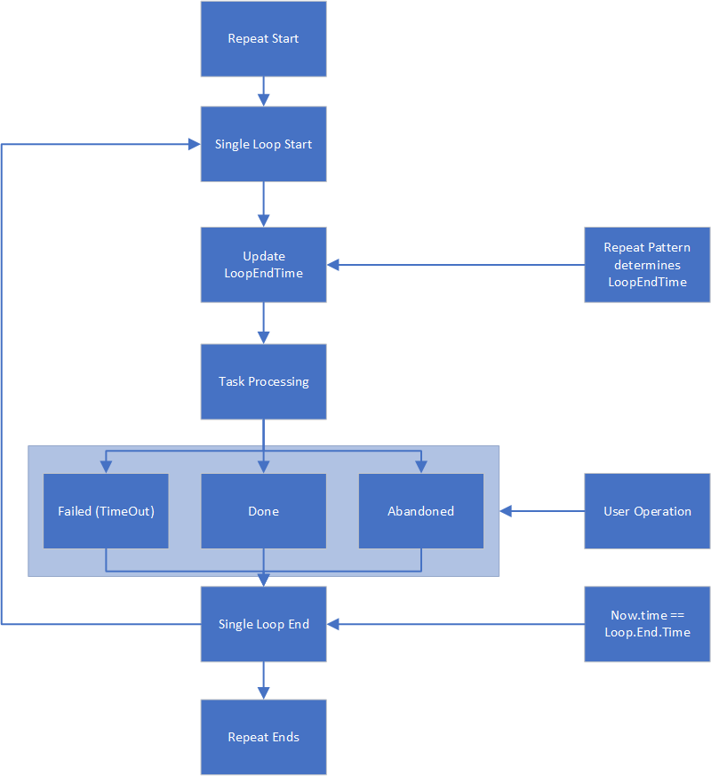

## class Task

    - id: int
    - name: string
    - description: string
    - category: dict<int, string>
    - created_at: datetime
    - begin_at: datetime
    - end_at: datetime
    - priority: int
    - status: enum
    - repetitive: bool
    - repeatPattern: ReapeatPattern
    - needReminder: bool
    - reminderTime: datetime

    with getters and setters

## class TaskManager

    - id: int
    - name: string
    - description: string
    - list: list<Task>
    - listView: list<Task>

    getter and setter for self.vars
    addTask(Task task)
    removeTask(Task task)
    getTask(int id)
    setTask(int id, Task task)
    
## Repeat Pattern

